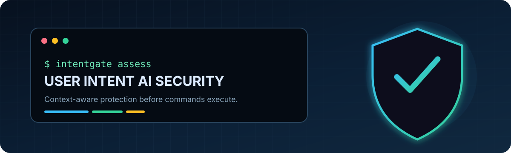
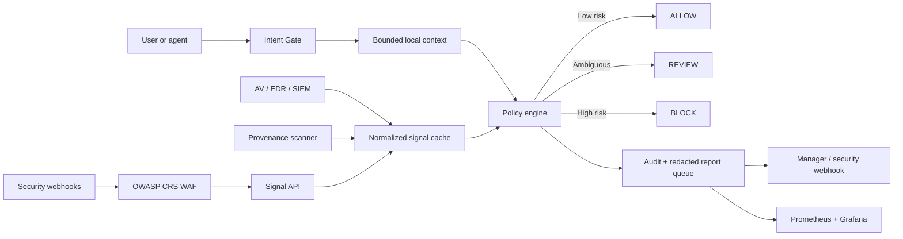

<div align="center">
  
</div>

<div align="center">

[](https://github.com/BB-AI-Arena/User-Intent-AI-Security/actions/workflows/ci.yml)
[](https://www.python.org/)
[](LICENSE)
[](#project-status)
[](docker-compose.observability.yml)
[](docs/WAF.md)
[](deploy/terraform)
[](deploy/ansible)

**A context-aware command execution gate that asks one critical question before code runs: _does this action match the user's intent?_**

[Quick start](#quick-start) · [How it works](#how-it-works) · [Integrations](#security-integrations) · [Dashboard](#grafana-dashboard) · [Security](SECURITY.md)

</div>

> [!IMPORTANT]
> User Intent AI Security is an early proof of concept, not a standalone security boundary. Reliable enforcement requires integration at a command broker, shell host, agent tool API, container runtime, or privileged-operation choke point that cannot be bypassed.

## Why this project exists

Traditional endpoint controls ask whether a command is known to be malicious. That is necessary, but incomplete. A legitimate administrative command can still be dangerous when it is unexpected, mistyped, overly broad, generated without adequate review, executed under elevated privileges, or inconsistent with the task the user was performing.

User Intent AI Security adds a pre-execution decision layer. It combines command semantics with live context and returns one of three outcomes:

| Decision | Meaning | Default behavior |
|---|---|---|
| `ALLOW` | Low-risk and consistent with available context | Execute silently |
| `REVIEW` | Ambiguous, elevated, or externally consequential | Require confirmation |
| `BLOCK` | High-confidence destructive or suspicious behavior | Do not execute |

The ordinary-command hot path is local and deterministic. External APIs, SIEM queries, provenance scans, and manager notifications run asynchronously and contribute cached signals without delaying execution.

## Highlights

- **Sub-millisecond policy evaluation** — approximately 0.53 ms for context collection and scoring in the development benchmark.
- **Intent-aware decisions** — evaluates declared purpose, recent activity, Git state, command behavior, and projected blast radius.
- **Privilege-sensitive policy** — detects Linux root, Linux administrative groups, and elevated Windows administrator sessions.
- **Cross-platform destructive-action catalog** — covers filesystem, storage, identity, networking, services, databases, containers, cloud resources, recovery controls, and audit-log changes.
- **Behavioral anomaly detection** — learns a local per-user baseline and identifies unusual command families.
- **AV, EDR, and SIEM context** — accepts normalized signals from common security platforms and correlates them by confidence and scope.
- **AI-assisted code risk signals** — performs a bounded, cached code-health/provenance scan without claiming unreliable authorship detection.
- **Privacy-conscious escalation** — queues redacted risk reports for an approved manager or security webhook.
- **Operational visibility** — ships with Prometheus metrics and a provisioned Grafana dashboard.
- **Protected API edge** — routes every published API request through OWASP ModSecurity CRS while keeping the backend on an internal-only network.
- **Standard-library core** — the gate has no mandatory runtime dependencies outside Python 3.11+.

## How it works



The decision engine considers:

1. The command and declared purpose.
2. Destructive capabilities and target scope.
3. Current user privilege and repository state.
4. Recent commands and the user's learned baseline.
5. Cached project provenance and code-health indicators.
6. Non-expired AV, EDR, and SIEM posture signals scoped to the device, user, or project.

See [Architecture](docs/ARCHITECTURE.md) and [Threat Model](docs/THREAT_MODEL.md) for the deeper design.

## Quick start

### Windows PowerShell

```powershell
git clone https://github.com/BB-AI-Arena/User-Intent-AI-Security.git
cd User-Intent-AI-Security

python -m venv .venv
.\.venv\Scripts\python.exe -m pip install -e .
. .\scripts\Enable-IntentGate.ps1

uig -- git status
uig --purpose "publish reviewed changes" --explain --dry-run -- git push
```

### Linux or macOS

```bash
git clone https://github.com/BB-AI-Arena/User-Intent-AI-Security.git
cd User-Intent-AI-Security

python3 -m venv .venv
.venv/bin/python -m pip install -e .

UIG_STATE_DIR="$PWD/.intentgate-state" .venv/bin/uig -- git status
```

Allowed commands stay quiet by default. Use `--explain` or `--json` to inspect a decision, and `--dry-run` to assess without executing.

```text
intentgate: BLOCK risk=100
   +90 destructive-action: Matched destructive catalog action(s): shadow-copy-delete.
   +25 admin-risk-amplifier: A risky command is being executed from an elevated Windows administrator session.
   +10 missing-purpose: No purpose was supplied for a risky operation.
```

### CLI reference

| Command | Purpose |
|---|---|
| `uig -- <command>` | Assess and execute a command |
| `uig --dry-run --explain -- <command>` | Assess without executing |
| `uig --purpose "..." -- <command>` | Supply the user's stated intent |
| `uig --shell -- <pipeline>` | Explicitly permit shell operators such as pipes |
| `uig-scan .` | Refresh cached project provenance signals |
| `uig-service` | Start signal-ingestion and metrics endpoints |
| `uig-collector config/integrations.json` | Poll configured security sources |
| `uig-notifier` | Deliver queued manager risk reports |

Exit codes are `0` for success, `2` for a non-allow dry run, `125` for review not approved, `126` for a blocked command, and `127` when the executable is missing.

## Risk signals

The current engine detects and correlates:

- Recursive or forced deletion and broad filesystem targets
- Filesystem formatting, raw-disk writes, partition and boot changes
- Service shutdown, firewall modification, and network resets
- User, group, ownership, ACL, and permission changes
- Scheduled persistence and security-control disabling
- Destructive SQL, container pruning, cluster deletion, and infrastructure destruction
- Cloud deletion and Git history rewrites
- Windows registry, event-log, and shadow-copy removal
- Download-to-execution pipelines, obfuscation, secret access, and potential exfiltration
- Publishing or deployment from dirty or apparently untested repositories
- Privileged execution, unusual command sequences, and external security posture

The catalog lives in [`src/intentgate/catalog.py`](src/intentgate/catalog.py) and is designed to grow into shell-specific AST policies.

## Security integrations

All integrations normalize into a small common signal:

```json
{
  "source": "microsoft-defender-xdr",
  "event_id": "alert-123",
  "score": 90,
  "confidence": 0.95,
  "ttl_seconds": 300,
  "detail": "Credential theft behavior detected",
  "scope": {"device": "EXAMPLE-HOST", "user": "example-user"}
}
```

| Integration | Method | Template status |
|---|---|---|
| Microsoft Defender Antivirus | Local PowerShell collector | Included |
| Microsoft Defender XDR | Authenticated REST polling | Included |
| Microsoft Sentinel | Authenticated REST polling | Included |
| CrowdStrike Falcon | Normalizer endpoint | Included |
| SentinelOne | Authenticated REST polling | Included |
| Splunk Enterprise Security | Export/search polling | Included |
| Elastic Security | Detection alert search | Included |
| Any security product | `POST /v1/signals` webhook | Supported |

Signals are deduplicated, confidence-weighted, scoped, and expired using TTLs. Vendor network calls never occur in the execution path. See [Integration Guide](docs/INTEGRATIONS.md).

## Grafana dashboard

Copy the example configuration and launch the observability stack:

```powershell
Copy-Item config\integrations.example.json config\integrations.json
Copy-Item .env.integrations.example .env.integrations
docker compose --env-file .env.integrations -f docker-compose.observability.yml up -d --build
```

| Service | Default URL |
|---|---|
| Grafana | `http://localhost:3000` |
| Prometheus | `http://localhost:9090` |
| WAF-protected Intent Gate API | `http://localhost:8787` |

The dashboard tracks aggregate security posture, active external signals, decision counts, policy latency, source-level risk, audited commands, and pending manager reports.

## Web application firewall

Docker deployments publish the official OWASP ModSecurity Core Rule Set Nginx proxy instead of the application container. The backend has no host port and lives on an internal-only network. Blocking is enabled by default at paranoia level 1, with additional level 2 detection telemetry, strict HTTP methods and content types, a 1 MiB body limit, disabled routine access logging, and bounded audit logs that exclude request headers and bodies.

```bash
curl http://127.0.0.1:8787/healthz
docker compose -f docker-compose.observability.yml logs waf
```

Configuration is available through the ignored environment file and the Ansible role. Review [WAF Operations](docs/WAF.md) before changing thresholds, adding rule exclusions, or publishing the listener beyond loopback.

> [!WARNING]
> Development credentials are intentionally simple. Change all passwords and tokens before exposing any service beyond localhost.

## Manager escalation

High-risk, blocked, or strongly anomalous commands create a local risk report. Likely passwords, tokens, API keys, bearer values, URL credentials, and common secret assignments are redacted before delivery.

```powershell
$env:UIG_MANAGER_ID = "security-operations"
$env:UIG_MANAGER_REPORT_THRESHOLD = "70"
$env:UIG_MANAGER_WEBHOOK_URL = "https://webhook.example.invalid/security"
$env:UIG_MANAGER_WEBHOOK_STYLE = "generic" # generic, slack, or teams
uig-notifier
```

Reporting is disabled until explicitly configured, and command execution never waits for delivery. Organizations should establish employee notice, retention, access control, and appeal procedures before deployment.

## Infrastructure as code

The repository includes two supported automation paths. Both reuse the canonical Compose definition instead of maintaining divergent copies of the application stack.

### Terraform

The [`deploy/terraform`](deploy/terraform) root module uses the `kreuzwerker/docker` provider's native `docker_compose` resource. It supports local engines, named Docker contexts, remote daemon URIs, optional environment files, Compose profiles, health waiting, and clean Terraform-managed teardown.

```bash
cd deploy/terraform
terraform init
terraform plan
terraform apply
```

### Ansible

The [`deploy/ansible`](deploy/ansible) role can bootstrap Docker Engine and Compose v2 on a Debian-family server, check out an approved version, render a protected environment file from Ansible Vault variables, deploy the stack, and verify the Intent Gate health endpoint.

```bash
cd deploy/ansible
ansible-galaxy collection install -r requirements.yml
ansible-playbook -i inventories/production.ini deploy.yml --ask-vault-pass
```

Terraform state, local variable files, production inventories, host variables, Vault material, and rendered secrets are excluded from Git. See the individual Terraform and Ansible guides for remote-host and lifecycle details.

## Development

```powershell
python -m venv .venv
.\.venv\Scripts\python.exe -m pip install -e .
.\.venv\Scripts\python.exe -m unittest discover -s tests -v
.\.venv\Scripts\python.exe -m compileall -q src tests
docker compose -f docker-compose.observability.yml config --quiet
```

The current suite covers policy outcomes, destructive patterns, privilege amplification, behavioral baselines, external signal correlation, reporting redaction, notifier delivery, service ingestion, and Prometheus metrics.

## Project status

Version **0.4.0** is a research-quality proof of concept. Important production work remains:

- Enforce at a non-bypassable execution boundary.
- Replace command regexes with PowerShell, POSIX shell, and command AST parsers.
- Resolve concrete filesystem, cloud, database, and infrastructure targets before execution.
- Add signed policy bundles, policy versioning, exception workflows, and tamper protection.
- Add explicit feed-health policy with fail-open, fail-closed, and review-only modes.
- Evaluate anomaly quality against representative benign and adversarial datasets.
- Add durable encrypted storage and enterprise identity for reports and policy administration.

## Responsible use

This project observes commands and can generate workplace security reports. Deploy it transparently, collect only what is necessary, protect the resulting data, and provide meaningful human review. Do not treat anomaly scores or AI-related signals as proof of malicious intent.

## Contributing

Contributions are welcome. Read [CONTRIBUTING.md](CONTRIBUTING.md), review the [Security Policy](SECURITY.md), and use the provided issue templates. By participating, you agree to the [Code of Conduct](CODE_OF_CONDUCT.md).

## License

Licensed under the [MIT License](LICENSE).
