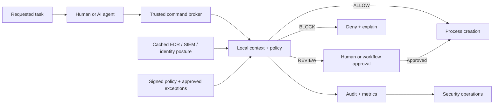

# Project vision: security between authorization and execution

## Executive summary

User Intent AI Security explores a pre-execution control for human and machine-generated commands. Its central idea is simple: authorization to use a tool does not imply that every possible use of that tool is appropriate. Before a process starts, a trusted command broker should evaluate whether the requested action matches the user's stated objective, recent activity, normal behavior, privilege, target scope, project condition, and current security posture.

The project is deliberately broader than a command denylist. It is a reference architecture for combining deterministic safety policy, behavioral context, software provenance indicators, security-product signals, explainable scoring, human review, and operational telemetry without adding vendor or model latency to routine commands.

## The security gap

Organizations already invest in identity, endpoint protection, logging, network security, privileged access, and change controls. Those systems are essential, but they frequently operate before or after the point where intent becomes an operating-system action:

- Identity and PAM establish who may act, but not whether a specific action matches the current task.
- Allowlisting establishes which tools may run, but powerful approved tools can perform harmful operations.
- EDR can detect suspicious behavior, but detection may occur after a process has started or damage has begun.
- SIEM correlates events well, but it is usually outside the synchronous command path.
- Change systems document expected work, but the terminal does not automatically compare each command with that expectation.
- AI safety filters reason about generated text, but the operating system ultimately executes concrete commands with real privileges and targets.

An intent gate connects these layers at the last responsible moment: after a command has been proposed, but before it executes.

## Why the problem is becoming more urgent

### AI agents increase command volume and speed

An AI agent can produce and execute many commands faster than a person can review them. Even when its high-level objective is correct, it may misunderstand the environment, choose an overly broad target, continue from stale context, or turn an untrusted response into executable input. A low-friction policy boundary lets an organization supervise actions without requiring a person to approve every harmless read-only command.

### Legitimate tools are dual-use

Administrative utilities, shells, infrastructure tools, database clients, and cloud CLIs are normal components of enterprise work. Malware reputation cannot distinguish a carefully scoped maintenance command from the same trusted binary deleting production resources or weakening security controls.

### Privilege makes ordinary mistakes exceptional

A typo in an unprivileged sandbox and the same typo as root have different consequences. Intent-aware policy can treat privilege as a risk amplifier instead of assuming that successful elevation settles the safety question.

### Security context is fragmented

An endpoint alert, unusual identity event, dirty repository, missing tests, secret-access sequence, and destructive command may each be inconclusive alone. Together they can justify review or prevention. The gate provides a common decision point for those otherwise disconnected facts.

## Core principles

1. **Decide before execution.** Prevention must occur at a process-creation or privileged-action boundary, not only in downstream logs.
2. **Keep the common path local.** Routine decisions should not wait on a model, SaaS API, SIEM query, or webhook.
3. **Treat context as time-bound evidence.** External signals expire, behavioral baselines evolve, and stale information should not silently remain authoritative.
4. **Make decisions explainable.** Operators need named signals, score contributions, policy versions, and reproducible outcomes.
5. **Use privilege and blast radius as multipliers.** Risk depends on what the action can affect, not only on command keywords.
6. **Preserve human authority for ambiguity.** `REVIEW` is a first-class outcome between silent execution and hard denial.
7. **Minimize and protect telemetry.** Commands and reports can contain secrets or sensitive employee activity; collection, redaction, access, and retention must be deliberate.
8. **Do not equate anomaly with malice.** Novel behavior is a reason to add context, not proof of wrongdoing.
9. **Fail deliberately.** Feed outages, policy errors, and broker failures need explicit fail-open, fail-closed, or review-only behavior by action class.
10. **Assume the wrapper can be bypassed.** Production value requires enforcement in the component that actually owns execution.

## Strategic value

### For security teams

- Convert endpoint and SIEM findings into immediate, scoped execution policy.
- Interrupt defense evasion, recovery deletion, suspicious exfiltration sequences, and high-risk administration earlier.
- Produce structured, explainable evidence for investigation instead of an unexplained block.
- Test policy changes in review or detection mode before enforcement.

### For platform and operations teams

- Add safety checks to deployment, cloud, Kubernetes, database, and infrastructure workflows.
- Distinguish normal automation from commands outside a service account's expected pattern.
- Reduce the chance that a typo, stale runbook, or wrong environment becomes an outage.
- Route ambiguous operations into approval instead of banning powerful tools entirely.

### For AI engineering teams

- Put a deterministic control beneath model-generated tool calls.
- Compare concrete actions with the user's original objective and recent agent trajectory.
- Keep security enforcement independent of which model or agent framework proposed the command.
- Gather decision telemetry for evaluating agent safety without treating model confidence as authorization.

### For governance and risk teams

- Define auditable policy around sensitive actions and privileged context.
- Measure how often risky commands are allowed, reviewed, blocked, overridden, or associated with active incidents.
- Establish transparent employee notice, retention, access, appeal, and oversight practices for behavioral signals.

## Reference operating model

The broker is the enforcement boundary. It receives structured arguments, user and device identity, a task or change reference, working context, and cached security posture. A versioned policy produces an outcome. High-confidence safe actions proceed immediately; ambiguous actions use an approval workflow; dangerous actions stop before process creation.

## What success should look like

A production implementation should be evaluated with more than raw block counts:

| Objective | Example measure |
|---|---|
| Invisible normal operation | p50/p95/p99 decision latency and percentage of routine commands silently allowed |
| Prevention quality | Confirmed harmful or out-of-intent actions blocked before execution |
| Operator usability | Review rate, approval time, override rate, and abandonment rate |
| Detection quality | False-positive and false-negative rates on representative workflows |
| Explainability | Percentage of decisions with actionable, policy-linked reasons |
| Resilience | Behavior during feed, storage, policy, and broker failures |
| Privacy | Data fields collected, redaction effectiveness, retention, and access audit coverage |
| Policy health | Drift, exception age, unused rules, and decision changes between policy versions |

## Roadmap from POC to production

### Phase 1: research and evaluation

- Expand benign and adversarial command datasets.
- Benchmark latency and detection quality across Windows and Linux.
- Tune the destructive catalog and external signal normalization.
- Validate privacy controls and reporting workflows with stakeholders.

### Phase 2: trusted command broker

- Move enforcement from an optional CLI wrapper into a persistent service that owns process creation.
- Accept structured executable and argument arrays rather than relying on reconstructed command strings.
- Add PowerShell, POSIX shell, and platform-specific parsers.
- Resolve filesystem, database, cloud, cluster, and infrastructure targets before scoring blast radius.

### Phase 3: enterprise policy and identity

- Add signed policy bundles, versioning, staged rollout, simulation, and rollback.
- Integrate device identity, workforce identity, PAM, ticket/change context, and approval systems.
- Protect baselines, reports, and exceptions with encryption and role-based access.
- Define feed-health behavior per command class.

### Phase 4: production learning and assurance

- Continuously measure false positives, false negatives, overrides, and user friction.
- Add adversarial testing for parser confusion, baseline poisoning, stale context, and policy bypass.
- Support fleet management, attestation, tamper evidence, and independent audit export.
- Develop organization-specific policies without losing a portable, inspectable core.

## Boundaries and responsible use

This project must not be presented as proof that a user is malicious or that code was authored by AI. Behavioral rarity, code-health markers, and correlated alerts are fallible signals. High-impact decisions need transparent policy, meaningful review, protected evidence, and a way to challenge mistakes.

The current CLI is a proof of concept and is bypassable. The WAF protects the HTTP integration surface, not local process creation. Production deployment requires additional engineering, threat modeling, testing, legal and privacy review, and integration at a trusted execution boundary.
